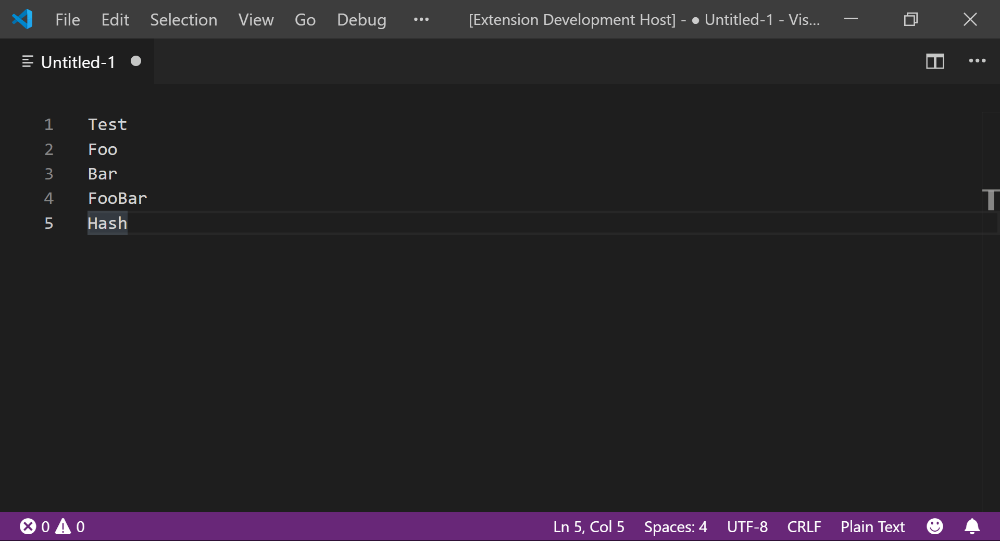

# Inline Hasher

An extension that allows you to insert hashes of the selected text.

## Commands

The following commands are available:

* `Replace selection with single hash...`: allows you to select a hash function and replace every selection with a specified format. `%1` is replaced with the original string and `%2` is replaced with the hash.
* `Replace selection with multiple hashes...`: allows you to replace every selection with a specified format that can include multiple hash functions. `%1` is replaced with the original string and `%<hash-function>[_^]` is replaced the with hash from the function specified by `hash-function` (see below for available hash functions), and if either suffix, `_` or `^`, is specified, the string will be converted to lowercase or uppercase respectively before calculating the hash.

## Hash Functions

The following hash functions are available:

| Name | Function |
|:---------:|:-------------:|
| [Jenkins one-at-a-time](https://en.wikipedia.org/wiki/Jenkins_hash_function#one_at_a_time) | joaat |
| [ELF](https://en.wikipedia.org/wiki/PJW_hash_function) | elf |
| [FNV-1a](https://en.wikipedia.org/wiki/Fowler–Noll–Vo_hash_function#FNV-1a_hash) | fnv1a |
| [FNV-1](https://en.wikipedia.org/wiki/Fowler–Noll–Vo_hash_function#FNV-1_hash) | fnv1 |
| [SHA-1](https://en.wikipedia.org/wiki/SHA-1) | sha1 |
| [SHA-224](https://en.wikipedia.org/wiki/SHA-2) | sha224 |
| [SHA-256](https://en.wikipedia.org/wiki/SHA-2) | sha256 |
| [SHA-384](https://en.wikipedia.org/wiki/SHA-2) | sha384 |
| [SHA-512](https://en.wikipedia.org/wiki/SHA-2) | sha512 |
| [MD5](https://en.wikipedia.org/wiki/MD5) | md5 |

## Credits

* [hash.js](https://github.com/indutny/hash.js) made by Fedor Indutny licensed under the MIT License.
* [ts-md5](https://github.com/cotag/ts-md5) made by CoTag Media licensed under the MIT License.
* Icon made by [Freepik](https://www.freepik.com/) from [www.flaticon.com](https://www.flaticon.com/) licensed under [CC 3.0 BY](http://creativecommons.org/licenses/by/3.0/).
